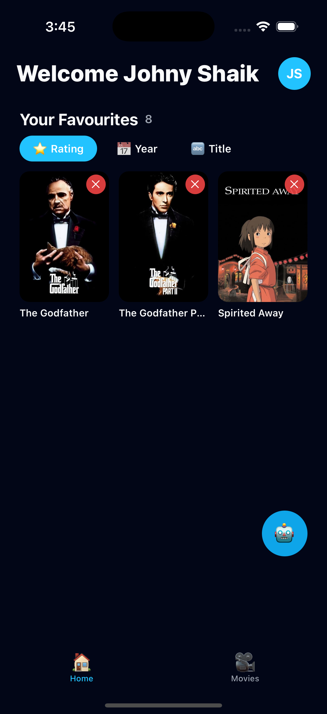
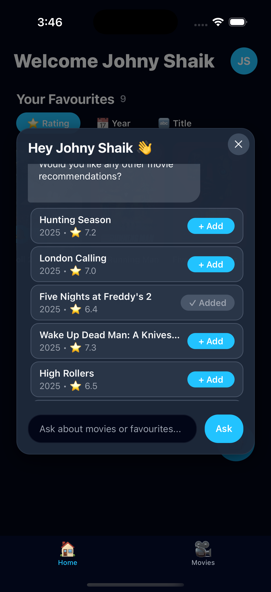
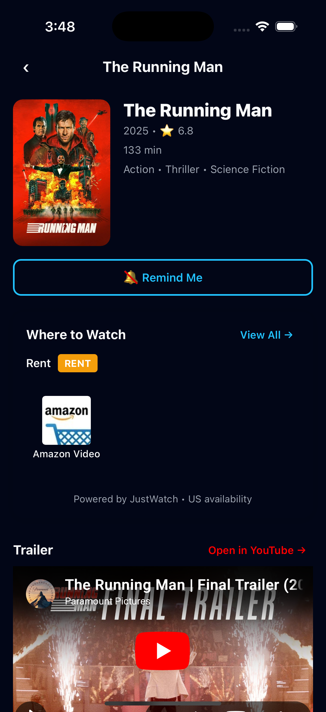
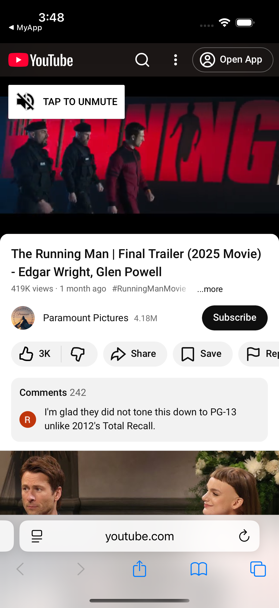
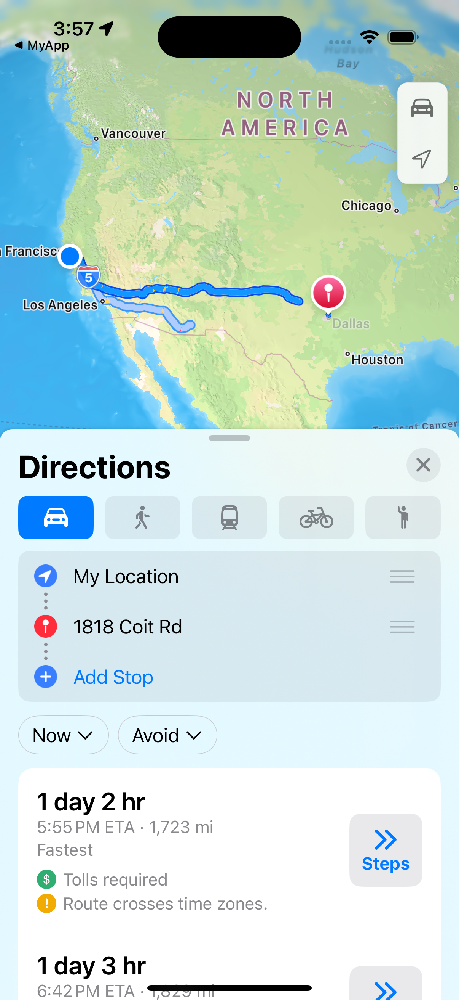
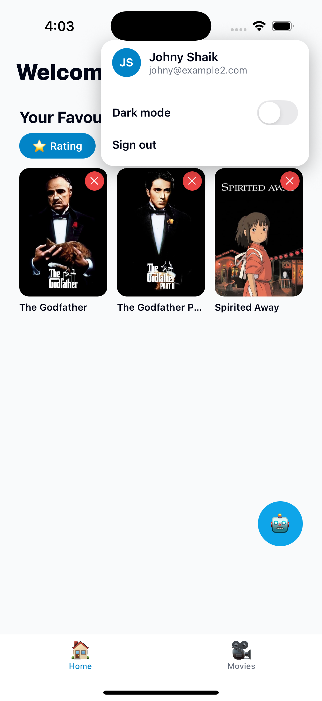
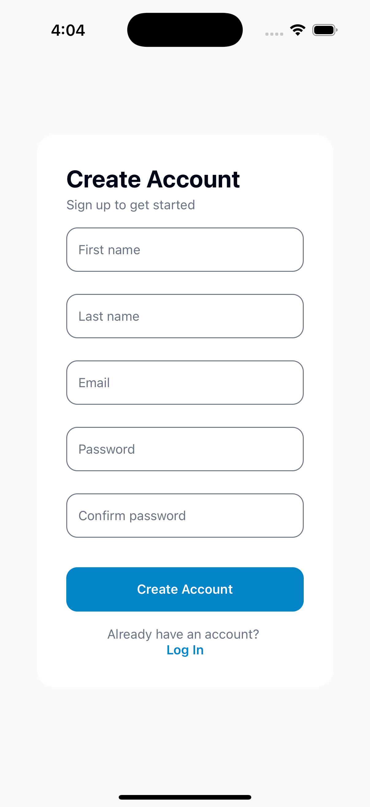
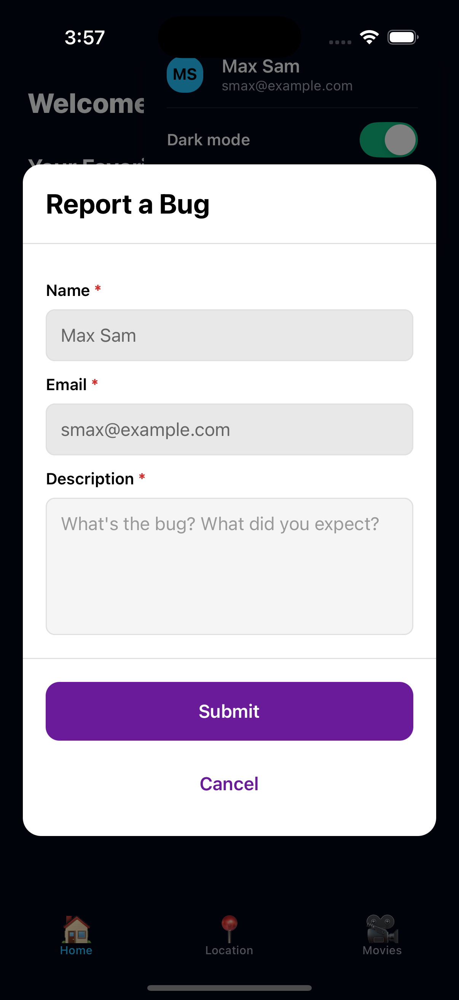
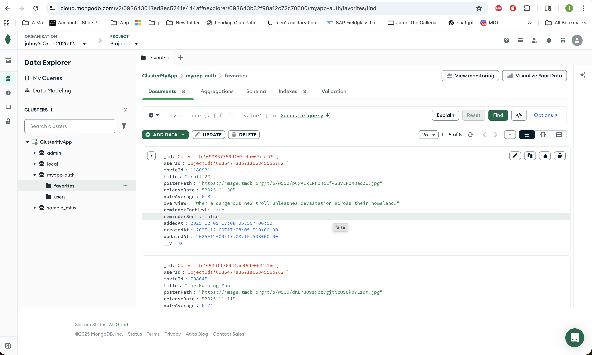

# MyApp - AI-Powered Movie Companion 🎬🤖

A modern React Native app combining movie discovery with an intelligent AI assistant using TMDB + OpenAI.

---

## 📱 About

MyApp is your personal movie companion that:
- Suggests movies based on taste
- Remembers chats for 24 hours
- Gives exact release dates
- Learns your favorite genres
- Lets you favorite movies from AI chat

Built with React Native + TypeScript + Redux + Node.js.

---

## 🎬 Movie Discovery

- 🔥 Popular  
- 🎬 Now Playing  
- 📅 Upcoming  
- ⭐ Top Rated  

Features:
- Smart search
- Genre filters
- Ratings & descriptions
- Favorites system
- Persistent storage

---

## 🤖 AI Companion

You can ask:
- "Suggest rom-com movies"
- "When is Avatar 3 releasing?"
- "Pick something for tonight"
- "Best action movies"

AI Features:
- ✅ 24-hour memory
- ✅ Exact release dates
- ✅ Personalized recommendations
- ✅ Smart favorite filtering
- ✅ AI won’t suggest already-favorited movies
- ✅ Quick suggestion buttons

---
## 🎭 Theatre Finder

Find nearby movie theaters with ease:
- 📍 Location-based search using GPS
- 🔢 Zip code search option
- 🗺️ Integration with Google Places API
- 📏 Distance calculation from your location
- 🧭 One-tap directions via Google Maps/Apple Maps
- ↻ Pull to refresh functionality
- 🎯 Filters theaters within 20-mile radius

Features:
- Automatic location permission handling
- Real-time theater information
- Sorted by distance (nearest first)
- Direct navigation integration
- Cross-platform map support (iOS/Android)

---
## 🛠 Tech Stack

Frontend:
- React Native
- TypeScript
- Redux Toolkit
- React Navigation
- AsyncStorage

Backend:
- Node.js
- Express
- OpenAI API
- TMDB API

---

## System Architecture Overview

```
+---------------------+         +------------------------+
|  Google/Apple SSO   |         |   Movie Data APIs      |
|    (SSO Provider)   |         |   (External/Backend)   |
+----------+----------+         +-----------+------------+
           |                                ^
           v                                |
+---------------------+         +-----------+------------+
|      Firebase       |<------->| movie-companion-backend |
|   (Auth & SSO)      |         |   (movie data, etc.)    |
+----------+----------+         +-----------+------------+
           |                                ^
           v                                |
+---------------------+         +-----------+------------+
|    Mobile App       |<------->|      auth-server        |
|   (React Native)    |  REST   |  (Node.js/Express)      |
|                     |  APIs   | (Token validation,      |
+----------+----------+         |  user, favorites,       |
           |                    |  reminders, etc.)       |
           +------------------->|                        |
                                +------------------------+
```

- **Mobile App**: React Native client, authenticates via Firebase SSO, communicates with backend via REST APIs.
- **Firebase**: Handles authentication (Google/Apple SSO), issues tokens.
- **auth-server**: Node.js/Express backend, validates tokens, manages user data, favorites, reminders.
- **movie-companion-backend**: Provides movie data, interacts with external movie APIs.
- **Movie Data APIs**: External sources for movie information.

**Data Flow:**
- User logs in via SSO (Google/Apple) → Firebase issues token → App uses token for API calls → auth-server validates token and serves data → movie-companion-backend fetches movie info as needed.


## 🚀 Running the App

Install:
```bash
yarn install
cd ios && pod install && cd ..
```

---

## 📸 Screenshots

### Authentication & Dashboard
   

### AI Movie Companion
     

    

### Movie Details & Trailers
    

### Theatre Finder
    

### Additional Features
   

### Dark Mode & User Management
    

### Feedback


### Backend (MongoDB)




