# MyApp - AI-Powered Movie Companion 🎬🤖

A modern React Native app combining movie discovery with an intelligent AI assistant using TMDB + OpenAI.

---

## 📱 About

MyApp is your personal movie companion that:
- Suggests movies based on taste
- Remembers chats for 24 hours
- Gives exact release dates
- Learns your favorite genres
- Lets you favorite movies from AI chat

Built with React Native + TypeScript + Redux + Node.js.

---

## 🎬 Movie Discovery

- 🔥 Popular  
- 🎬 Now Playing  
- 📅 Upcoming  
- ⭐ Top Rated  

Features:
- Smart search
- Genre filters
- Ratings & descriptions
- Favorites system
- Persistent storage

---

## 🤖 AI Companion

You can ask:
- "Suggest rom-com movies"
- "When is Avatar 3 releasing?"
- "Pick something for tonight"
- "Best action movies"

AI Features:
- ✅ 24-hour memory
- ✅ Exact release dates
- ✅ Personalized recommendations
- ✅ Smart favorite filtering
- ✅ AI won’t suggest already-favorited movies
- ✅ Quick suggestion buttons

---
## 🎭 Theatre Finder

Find nearby movie theaters with ease:
- 📍 Location-based search using GPS
- 🔢 Zip code search option
- 🗺️ Integration with Google Places API
- 📏 Distance calculation from your location
- 🧭 One-tap directions via Google Maps/Apple Maps
- ↻ Pull to refresh functionality
- 🎯 Filters theaters within 20-mile radius

Features:
- Automatic location permission handling
- Real-time theater information
- Sorted by distance (nearest first)
- Direct navigation integration
- Cross-platform map support (iOS/Android)

---
## 🛠 Tech Stack

Frontend:
- React Native
- TypeScript
- Redux Toolkit
- React Navigation
- AsyncStorage

Backend:
- Node.js
- Express
- OpenAI API
- TMDB API

---

## 🚀 Running the App

Install:
```bash
yarn install
cd ios && pod install && cd ..
```

---

## 📸 Screenshots

### Authentication & Dashboard
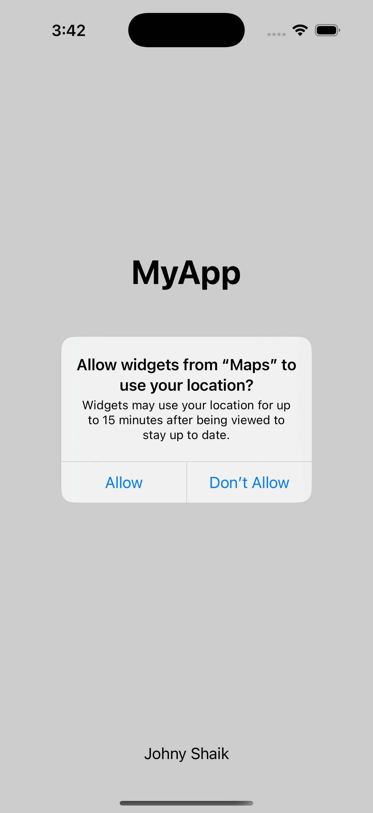  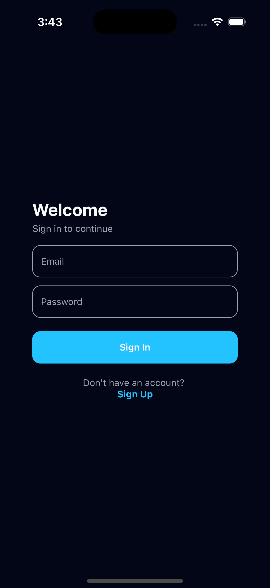 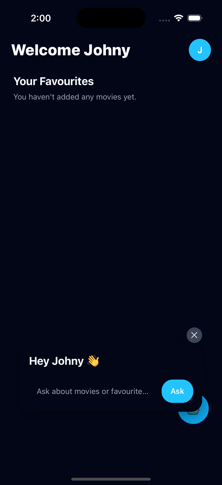

### AI Movie Companion
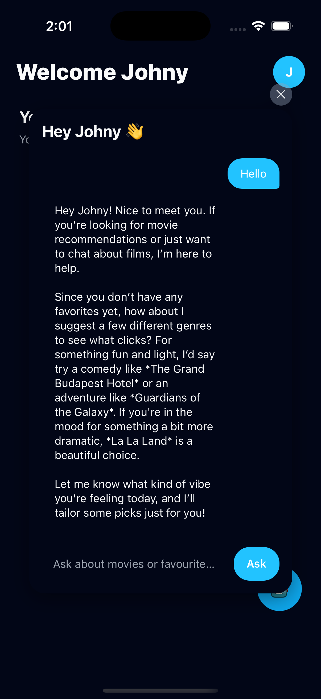  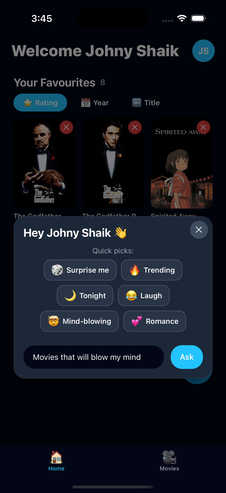 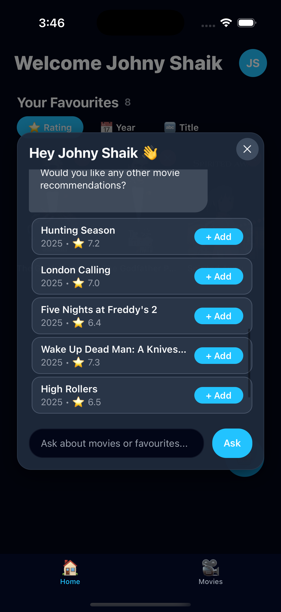  

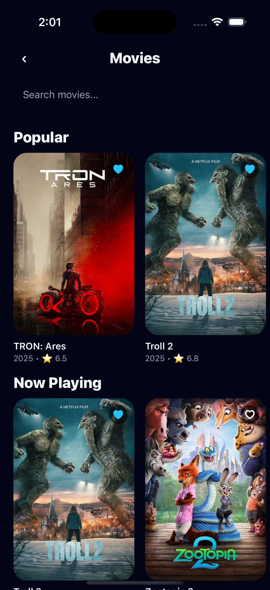  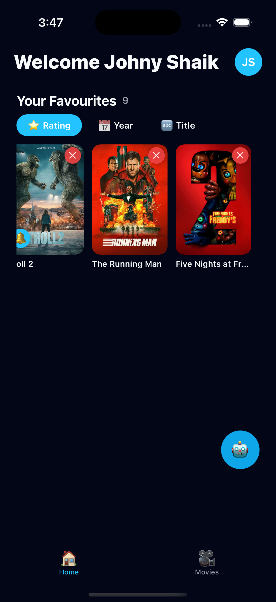  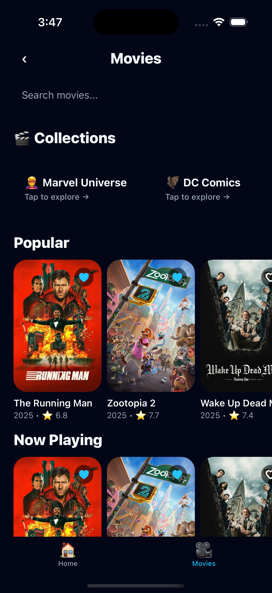

### Movie Details & Trailers
  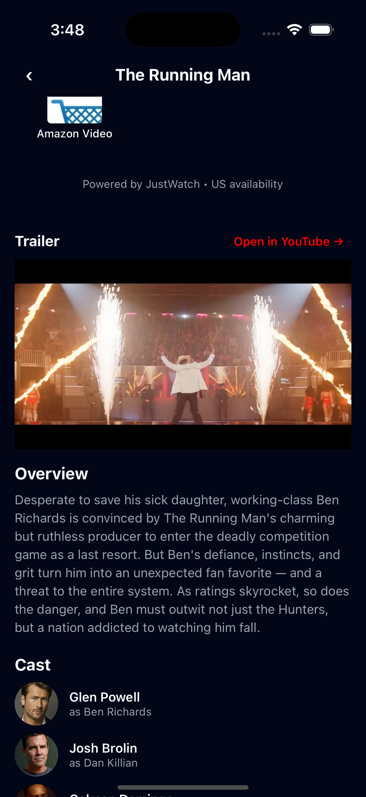  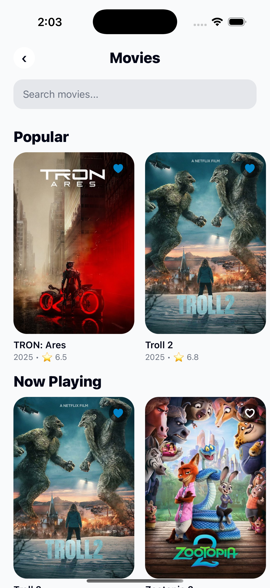

### Theatre Finder
  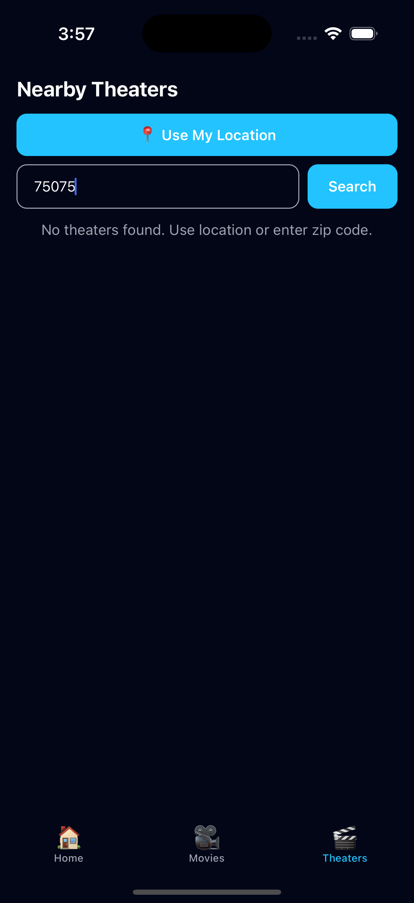  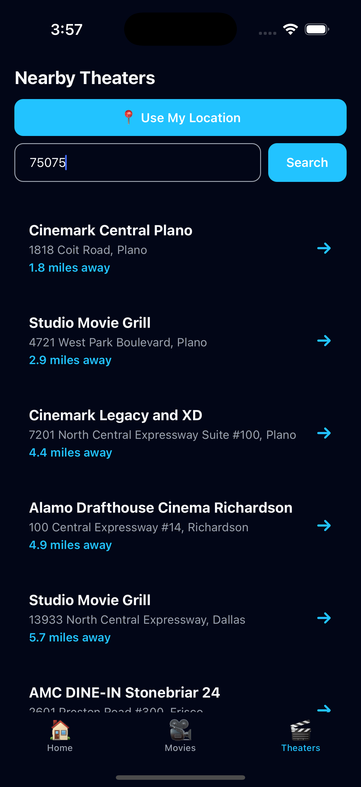

### Additional Features
   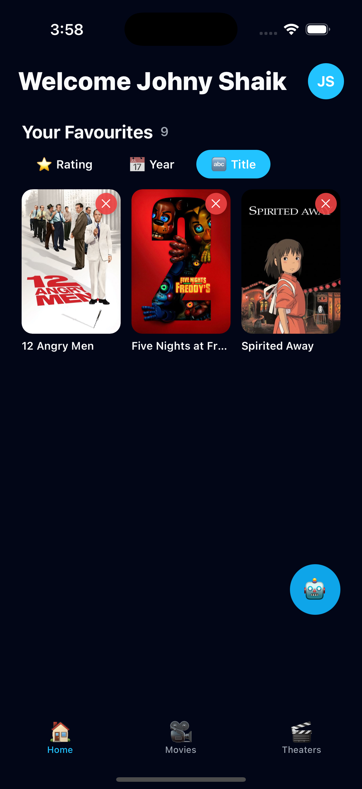

### Dark Mode & User Management
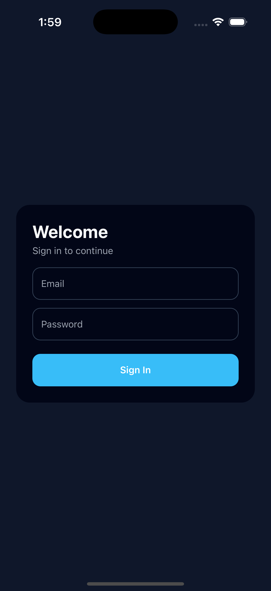  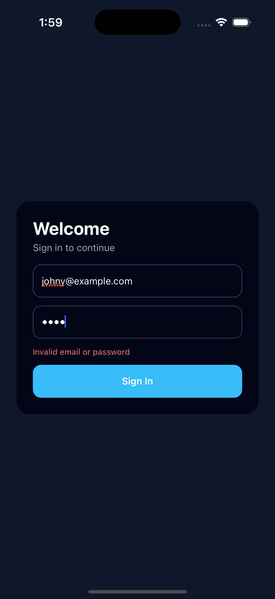  


### Backend (MongoDB)

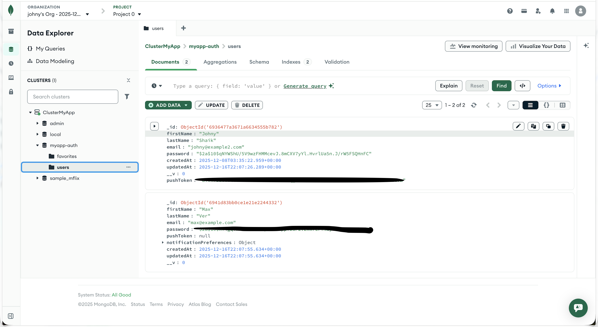


